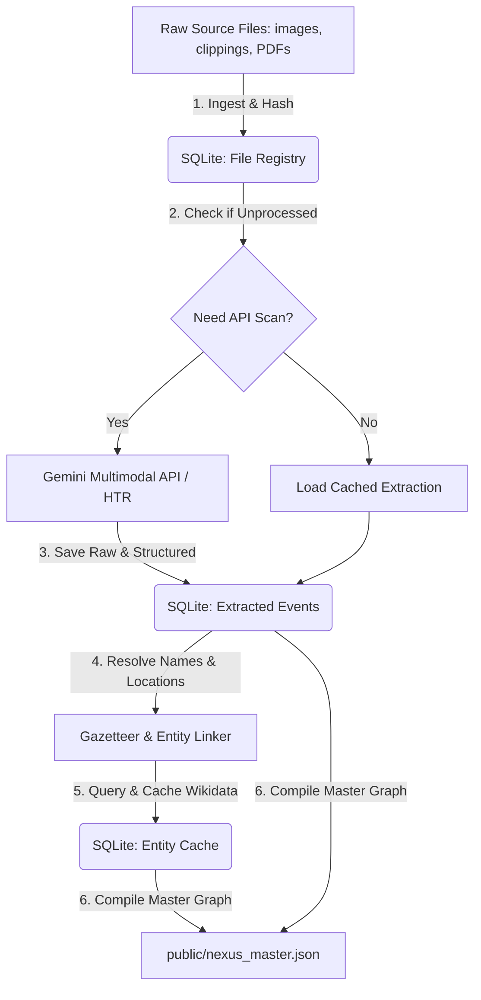

# Pipeline Architecture: Historical Data Ingestion & Enrichment

To scale the Gamla Stan Nexus project to thousands of records (tax registers, police logs, fire records, newspapers), the pipeline must move away from flat JSON file rewrites. 

This document outlines a database-driven architecture that introduces **incremental ingestion**, **caching**, and **robust entity resolution** to optimize cost and performance.

---

## 1. Core Architecture Overview

Instead of reading all source files and rewriting the master JSON every time, the pipeline will utilize a local SQLite database (`data_sources/nexus_history.db`) as the source of truth. 



### Key Benefits
* **Cost Efficiency:** Files are hashed. If a scan image or text clipping hasn't changed, the pipeline skips the Gemini API call, preventing duplicate API costs.
* **Incremental Updates:** You can add 5 new files, run the script, and only those 5 files will be processed, appending them to the database.
* **Data Integrity:** Keeping raw LLM responses and processed records in SQLite allows database migrations and regex tweaks without losing past transcriptions.

---

## 2. Database Schema (`nexus_history.db`)

Here is the proposed SQLite schema to support multi-source historical ingestion:

```sql
-- Track all processed source files to avoid duplicate HTR/OCR API calls
CREATE TABLE IF NOT EXISTS source_files (
    filepath TEXT PRIMARY KEY,       -- Path relative to project root (e.g. 'data_sources/images/1787.jpg')
    file_hash TEXT NOT NULL,         -- SHA-256 hash of file contents to detect changes
    status TEXT NOT NULL,            -- 'processed', 'failed'
    processed_at DATETIME DEFAULT CURRENT_TIMESTAMP,
    source_type TEXT NOT NULL,       -- 'Newspaper', 'Police Record', 'Fire Record', 'Parish Record'
    record_count INTEGER DEFAULT 0
);

-- Store the structured events extracted by Gemini or regex
CREATE TABLE IF NOT EXISTS extracted_events (
    id INTEGER PRIMARY KEY AUTOINCREMENT,
    source_file TEXT,                -- Foreign key referencing source_files(filepath)
    label TEXT NOT NULL,             -- Event title (e.g., "Eldsvåda: Svartmangatan")
    event_date TEXT,                 -- YYYY-MM-DD or YYYY format
    address TEXT,                    -- Extracted location string
    latitude REAL,
    longitude REAL,
    description TEXT,                -- Modern Swedish summary
    original_text TEXT,              -- Transcription of original text
    resident_name TEXT,              -- Main person mentioned
    record_type TEXT NOT NULL,       -- 'Newspaper', 'Police Record', etc.
    crime TEXT,                      -- (Optional) Crime type
    suspect TEXT,                    -- (Optional) Suspect name
    victim TEXT,                     -- (Optional) Victim name
    fire_cause TEXT,                 -- (Optional) Cause of fire
    damage_level TEXT,               -- (Optional) Level of damage
    parish_event TEXT,               -- (Optional) Baptism/Marriage/Burial
    raw_response TEXT,               -- Complete JSON payload returned by LLM (for debugging/re-parsing)
    FOREIGN KEY(source_file) REFERENCES source_files(filepath) ON DELETE CASCADE
);

-- Cache Wikidata queries to prevent rate-limits and speed up compilation
CREATE TABLE IF NOT EXISTS wikidata_cache (
    name_query TEXT PRIMARY KEY,     -- Search term used (e.g., "Olof Berg")
    wikidata_id TEXT,                -- Q-number (null if not found)
    canonical_name TEXT,             -- Normalized label
    birth_year INTEGER,
    death_year INTEGER,
    occupation TEXT,
    parents TEXT,                    -- Comma-separated parent names
    children TEXT,                   -- Comma-separated child names
    cached_at DATETIME DEFAULT CURRENT_TIMESTAMP
);
```

---

## 3. Advanced Entity & Location Resolution

To ensure the coordinates and relationship graphs map correctly, we need to handle archaic spelling variants and complex names.

### A. The Stockholm Gazetteer
Gamla Stan's streets had different names in the 1700s (e.g., *Stora Nygatan* was sometimes called *Kongliga Nygatan*, and alleys changed names frequently). 
* **Next Step:** We will extend the gazetteer in the script to support a dictionary of **synonyms** mapping archaic Swedish spellings to modern street coordinates.
* **Quarter Mapping:** We will add a database mapping Gamla Stan's official historical quarters (e.g., *Cepheus*, *Cygnus*, *Phaeton*) to bounding coordinates, so that if a document mentions a quarter rather than a street, it can still be geolocated.

### B. Personal Name Deduplication
If the *mantalslängder* list a tailor as `O. Berg` in 1785 and `Olof Berg` in 1786, the pipeline should ideally resolve them to the same entity.
* **Resolution Engine:** When building the graph, the script will apply matching rules: if two person nodes have identical/similar names, overlapping active years, and the same occupation or address, the linker will suggest merging them or automatically link them with a high-strength connection.

---

## 4. Ingestion Workflow Implementation Plan

1. **DB Initialization:** Create a database utility script that sets up `nexus_history.db`.
2. **Refactor Ingestion:** Update `extract_newspaper_data.py` to:
   * Calculate SHA-256 hashes of files under `data_sources/images/` and `data_sources/clippings/`.
   * Check the database: if the file hash matches a `processed` file, skip it.
   * Otherwise, run Gemini/regex, write results to `extracted_events`, and log the hash.
3. **Refactor Build Script:** Update `build_nexus_master.py` to query events directly from SQLite, run the Wikidata resolution caching queries, and output `public/nexus_master.json`.
